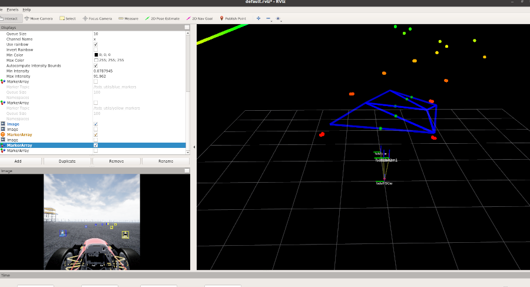
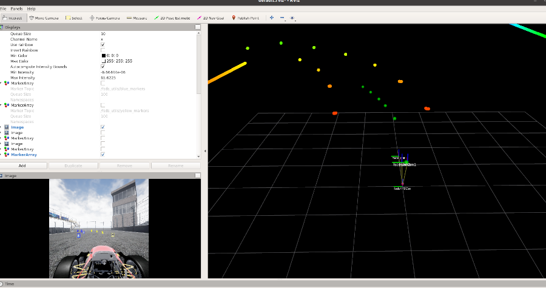

# Path planning algorithm

Package provides creating path for racing car using Delaunay triangulation.

## Requirements
- Ubuntu 20.04
- ROS Noetic
- DV Workspace


## Node description
- draw mesh - node takes blue and yellow cones positions from vision topic and calculate the path for racing car. Then the path is optimized by fitting a polynomial to it.





## Clone repository
```bash
# go to ROS src directory
cd /home/ue4/Formula-Student-Driverless-Simulator/ros/src

# clone repository
git clone -b ros-simulator https://github.com/PUT-Motorsport/PUTM_DV_Steering_2020.git putm_dv_steering/
```

### Run node (another terminal)
```bash
roslaunch putm_dv_steering draw_mesh.launch
```
