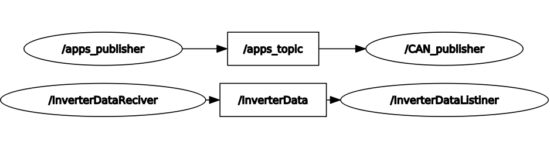

# CAN Inverter Communication

Package provides ROS <- CAN -> Inverter communication (both ways)


## Requirements
- Ubuntu 20.04
- ROS Noetic
- DV Workspace (from DV recruitment task)


## Nodes description
- ros_publisher - node takes user input and publish it to topic apps_topic
- CAN_publisher - node responsible for communication ROS -> Inverter
- CAN_reciver - node responsible for communication CAN -> ROS 
- Inv_Data_Reciver - node used for testing data from CAN_reciver node 



## Installation


```bash
cd ~/dv_ws/src
git https://github.com/GrzegorzCzput/CAN_Inverter_Communication.git CAN_apps/
```

## Usage
### Import can library and create a virtual CAN

```bash
modprobe can_dev
modprobe can_raw
modprobe vcan
sudo ip link add dev vcan0 type vcan
sudo ip link set up vcan0
```

### Give permissions to execute
for example
``` bash 
chmod +x CAN_reciver.py
```

### Build workspace
```bash
cd ~/dv_ws
catkin_make
source devel/setup.bash
roscore
```

### Run node (another terminal)
```bash
cd ~/dv_ws
source devel/setup.bash
rosrun CAN_apps CAN_publisher.py 
```
